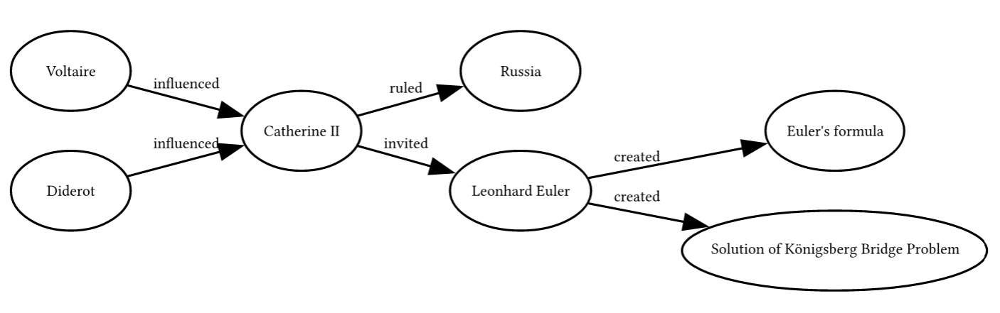
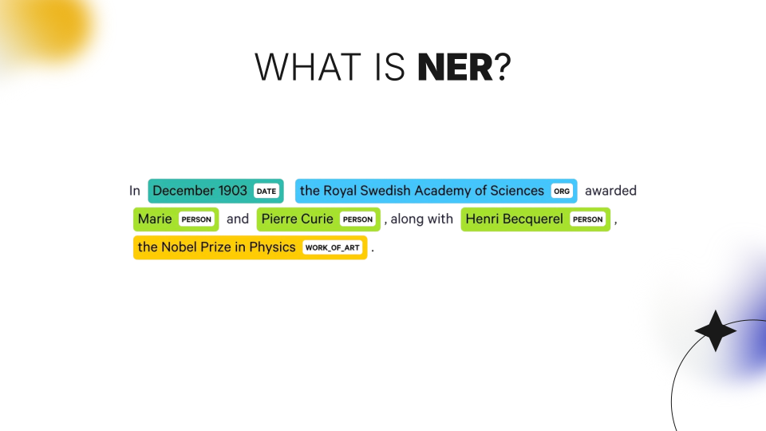
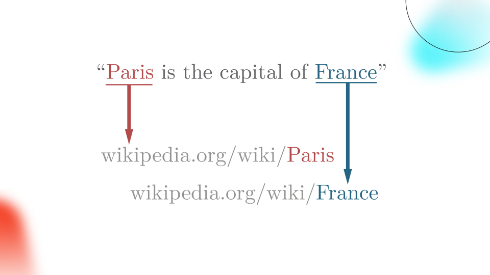
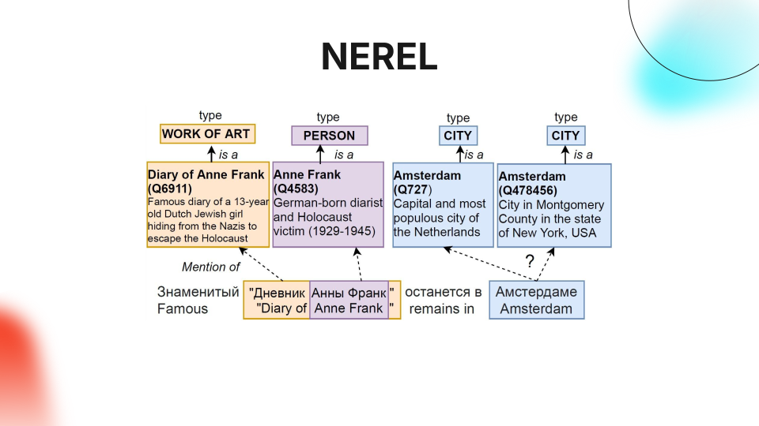

# Modern NER, EL & RE

> [Presentation](./presentation.pdf)

> [Final Report](./reports/final.pdf)

## Overview

We intended to implement a service that would create a knowledge graph based on the text submitted for input and present this information as a graph or a mindmap to the end user. Key technologies for that are <u>Named Entity Recognition (NER)</u>, <u>Entity Linking (EL)</u>, and <u>Relation Extraction (RE)</u>.

*Example input:*

> Catherine II, also known as Catherine the Great, was the Empress of Russia from 1762 until her death in 1796. She is considered one of the most renowned and longest-ruling female leaders in Russian history. Catherine was a proponent of Enlightened Absolutism, which advocated for the use of absolute power to bring about reforms inspired by the Enlightenment. She corresponded with notable figures like Voltaire and Diderot. Leonhard Euler was invited to the Imperial Russian Academy of Sciences by Catherine II. Leonhard Euler singnificantly contributed to mathematics and graph theory during his time in Russia. His achivements include Euler’s formula for polyhedra and solution of Königsberg Bridge Problem

*Example output:*



## Named Entity Recognition (NER)



<!-- - LSTM -->
<!-- - BERT -->

## Entity Linking (EL)



## Relation Extraction (RE)


<!-- - mrebel -->

## closed Information Extraction (EL + RE = cIE)

<!-- - ReLiK -->


## Russian cIE

<!-- - NEREL -->



<!-- - SPN4RE -->


## Structure

```
modern-ner-el-and-re
 ┣ assets  # static files
 ┃ ┗ *.{svg,png}
 ┣ papers  # related scientific papers
 ┃ ┗ *.pdf
 ┣ reports  # intermediate/final reports during research
 ┃ ┗ *.pdf
 ┣ repos  # submodules (repositories) used in experiments
 ┃ ┣ SPN4RE-NEREL
 ┃ ┗ relik
 ┣ .gitmodules
 ┣ README.md
 ┗ presentation.pdf  # final presentation
```

## Papers

<!-- | NER    | **LSTM**    |                                                                                                          |                                                                                  |
| NER    | **BERT**    |                                                                                                          |                                                                                  |
|        | **RoBERTa** | RoBERTa: A Robustly Optimized BERT Pretraining Approach                                                  | [Link](https://arxiv.org/pdf/1907.11692)                                         | -->


| Topics | Keyword     | Full Name                                                                                                | Arxiv                                                                            |
| ------ | ----------- | -------------------------------------------------------------------------------------------------------- | -------------------------------------------------------------------------------- |
| *RE*     | **REBEL**   | REBEL: Relation Extraction By End-to-end Language generation                                             | [Link](https://paperswithcode.com/paper/rebel-relation-extraction-by-end-to-end) |
| *RE*     | **mREBEL**  | RED FM: a Filtered and Multilingual Relation Extraction Dataset                                          | [Link](https://arxiv.org/pdf/2306.09802)                                         |
| *cIE*    | **ReLiK**   | ReLiK: Retrieve and LinK, Fast and Accurate Entity Linking and Relation Extraction on an Academic Budget | [Link](https://arxiv.org/pdf/2408.00103v2)                                       |
| *NER RE* | **NEREL**   | NEREL: A Russian Dataset with Nested Named Entities, Relations and Events                                | [Link](https://arxiv.org/pdf/2108.13112)                                         |
| *RE*     | **SPN4RE**  | Joint Entity and Relation Extraction with Set Prediction Networks                                        | [Link](https://arxiv.org/pdf/2011.01675)                                         |
| *NER EL* | **NER4EL**  | Named Entity Recognition for Entity Linking: What Works and What’s Next                                  | [Link](https://aclanthology.org/2021.findings-emnlp.220.pdf)                     |

<!-- |        | DPR        |                                                              |                                                                                  |
|        | EntQA      |                                                              |                                                                                  | -->

<!-- https://paperswithcode.com/paper/named-entity-recognition-with-bidirectional
https://paperswithcode.com/paper/zero-shot-entity-linking-with-dense-entity
https://paperswithcode.com/paper/visual-fudge-form-understanding-via-dynamic -->
