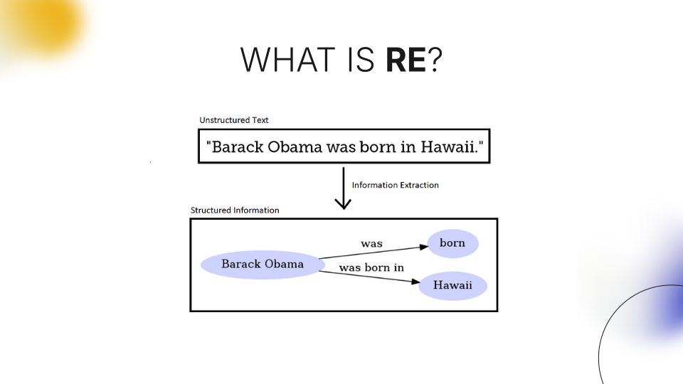

# Modern NER, EL & RE

> [Presentation](./presentation.pdf)

> [Final Report](./reports/final.pdf)

## Overview

...

## Named Entity Recognition (NER)


<!-- - LSTM -->
<!-- - BERT -->

## Entity Linking (EL)


## Relation Extraction (RE)



<!-- - mrebel -->

## closed Information Extraction (EL + RE = cIE)

<!-- - ReLiK -->


## Russian cIE

<!-- - NEREL -->


<!-- - SPN4RE -->


## Structure

```
modern-ner-el-and-re
 ┣ assets
 ┃ ┗ *.svg
 ┣ papers
 ┃ ┗ *.pdf
 ┣ reports
 ┃ ┣ 1.pdf
 ┃ ┣ 2.pdf
 ┃ ┣ 3.pdf
 ┃ ┗ final.pdf
 ┣ repos
 ┃ ┣ SPN4RE-NEREL
 ┃ ┗ relik
 ┣ .gitmodules
 ┣ README.md
 ┗ presentation.pdf
```

## Papers

- LSTM
- BERT [RoBERTa](https://arxiv.org/pdf/1907.11692)
- [REBEL](https://paperswithcode.com/paper/rebel-relation-extraction-by-end-to-end)
- [mREBEL](https://arxiv.org/pdf/2306.09802)
- [ReLiK](https://arxiv.org/pdf/2408.00103v2)
- [NEREL](https://arxiv.org/pdf/2108.13112)
- [SPN4RE](https://arxiv.org/pdf/2011.01675)
- [NER4EL](https://aclanthology.org/2021.findings-emnlp.220.pdf)


- [DPR]()
- [EntQA]()


<!-- https://paperswithcode.com/paper/named-entity-recognition-with-bidirectional
https://paperswithcode.com/paper/zero-shot-entity-linking-with-dense-entity
https://paperswithcode.com/paper/visual-fudge-form-understanding-via-dynamic -->